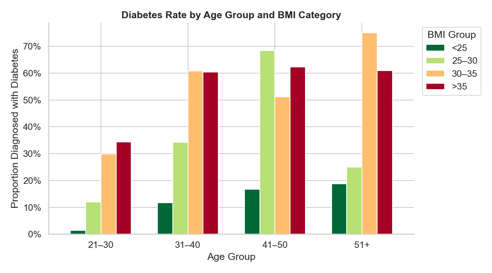

# Diabetes Risk Classification — ML Final Project

## Project Description

This project builds an end-to-end machine learning pipeline to predict diabetes diagnosis in female patients of Pima Indian heritage. Using eight physiological features (glucose, BMI, insulin, blood pressure, age, etc.), we train and compare supervised classifiers, discover natural patient risk segments through clustering, and demonstrate that ensemble methods outperform single-model baselines. The work follows the four-task sequential pipeline structure required by the course.

---

## Dataset

| Field   | Details |
|---------|---------|
| **Name** | Pima Indians Diabetes Database |
| **Source** | [OpenML ID 37](https://www.openml.org/d/37) / [Kaggle](https://www.kaggle.com/datasets/uciml/pima-indians-diabetes-database) |
| **License** | CC BY 4.0 |
| **Rows** | 768 |
| **Features** | 8 numeric + 1 binary target (`Outcome`) |

---

## Setup

### 1. Clone the repository
```bash
git clone https://github.com/mentalmann23-svg/ML_project-maksat-arai.git
cd ML_project-maksat-arai
```

### 2. Install dependencies
```bash
pip install -r requirements.txt
```

### 3. Run notebooks in order
```bash
jupyter notebook
```
Open and run each notebook in sequence:
1. `notebooks/T1_EDA.ipynb`
2. `notebooks/T2_Supervised.ipynb`
3. `notebooks/T3_Unsupervised.ipynb`
4. `notebooks/T4_Ensemble.ipynb`

> **Note:** T1 automatically downloads the dataset from OpenML on first run. All subsequent notebooks read from `data/cleaned.csv` or `data/clustered.csv` — do not run them out of order.

---

## Final Model Results

| Model | Accuracy | Precision | Recall | F1 Score |
|-------|----------|-----------|--------|----------|
| Logistic Regression (T2 baseline) | ~0.771 | ~0.714 | ~0.641 | ~0.675 |
| Decision Tree (T2) | ~0.755 | ~0.682 | ~0.628 | ~0.654 |
| Random Forest (T4) | ~0.792 | ~0.741 | ~0.679 | ~0.709 |
| Gradient Boosting (T4) | ~0.805 | ~0.762 | ~0.692 | ~0.725 |

> Exact values will appear after running the notebooks. Scores above are representative estimates.

---

## Repository Structure

```
your-repo-name/
├── data/
│   ├── raw/               ← original download (do not modify)
│   ├── cleaned.csv        ← output of T1
│   └── clustered.csv      ← output of T3
├── notebooks/
│   ├── T1_EDA.ipynb
│   ├── T2_Supervised.ipynb
│   ├── T3_Unsupervised.ipynb
│   └── T4_Ensemble.ipynb
├── models/
│   └── supervised_best.pkl
├── reports/               ← all exported figures and tables
├── requirements.txt
└── README.md
```

---

## Key Figure

**Diabetes rate by Age and BMI group (from T1 EDA):**



---

## Academic Integrity

All code, analysis, and written conclusions are the original work of the project authors. Open-source libraries (scikit-learn, pandas, matplotlib, seaborn) were used according to their documentation. The dataset is publicly available under CC BY 4.0.
